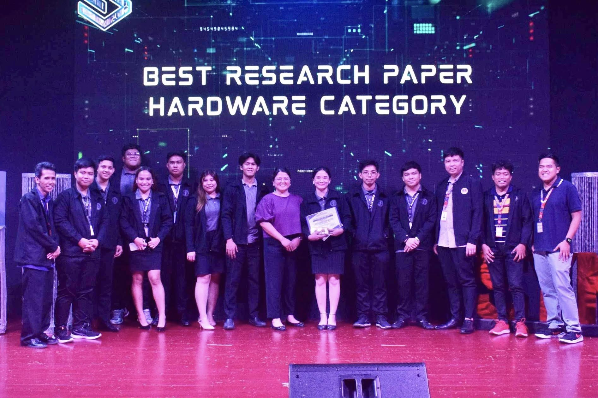
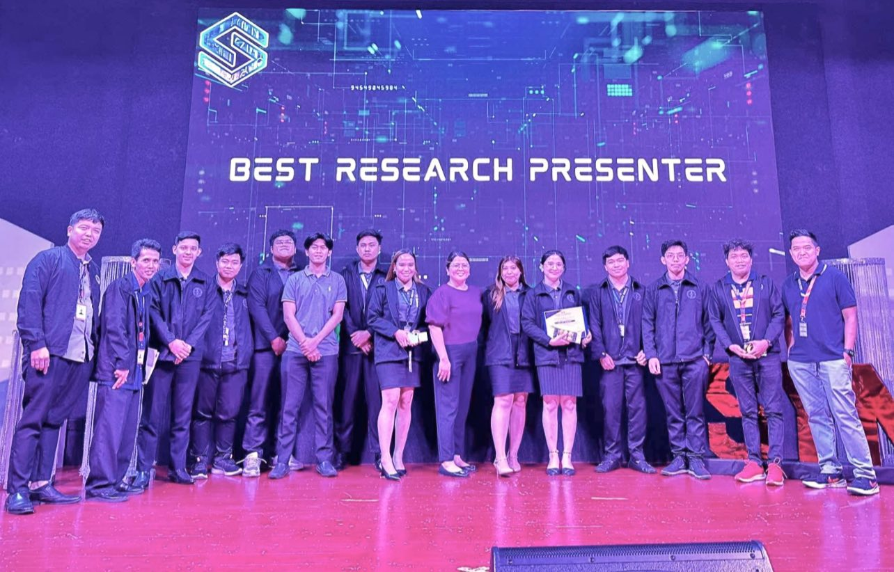

# POWERWALK DOCUMENTATION
- **POWERWALK**: Converting foot traffic into sustainable energy, utilizing piezoelectric transducers with RFID and data visualization for efficient power generation.

# Project Demonstration: Watch the Power Walk Technology Demonstration Video

# Hardware Source Code:
## RFIDREADER.ino File
- This C++ code ([RFIDREADER.ino](https://github.com/JCJ02/power-walk-arduino-uno/blob/main/RFIDREADER.ino)) is for reading the UID (Unique Identifier) of an RFID card using an RFID-RC522 module and an Arduino Uno (or similar board). It utilizes the MFRC522 and SPI libraries to communicate with the RFID module. We use this to store your RFID's UID in our system.

## ARDUINO.ino File
- This C++ code ([ARDUINO.ino](https://github.com/JCJ02/power-walk-arduino-uno/blob/main/ARDUINO.ino)) is designed for an RFID-based "Free Charging Station", where students can scan their RFID cards to activate a charging session. If their RFID card is verified, the system allows them to charge their devices for 15 minutes before automatically turning off.

## NODEMCU.ino File
- [NODEMCU.ino](https://github.com/JCJ02/power-walk-nodemcu-esp8266)

## HTTP Server of the Hardware
- The [server.php](https://github.com/JCJ02/power-walk-system-php) script acts as a central data handler for a system involving battery monitoring, electricity tracking, and RFID-based access control. It receives data about battery percentage, generated, consumed electricity, and RFID card IDs. Upon receiving this information, it updates a database with the current battery status and accumulated electricity generation and consumption. Furthermore, it verifies if an RFID card is registered and records access attempts, along with the corresponding electricity consumption associated with each successful entry. The script also maintains a daily log of electricity usage and generation, providing a comprehensive overview of the system's energy dynamics and access history.

# Software Source Code:
## Frontend of POWERWALK Software
- [Power Walk FE](https://github.com/JCJ02/power-walk-fe)

## Backend of POWERWALK Software
- [Power Walk API](https://github.com/JCJ02/power-walk-api)

# Technologies:
- [Arduino IDE](https://www.arduino.cc/en/software)
- [Visual Studio Code](https://code.visualstudio.com/)
- [XAMPP](https://www.apachefriends.org/download.html)

# Programming Languages:
- [C++](https://www.w3schools.com/cpp/cpp_intro.asp)
- [TypeScript](https://www.typescriptlang.org/)
- [PHP](https://www.php.net/)

# Frameworks:
- [NodeJS](https://nodejs.org/en)
- [ExpressJS](https://expressjs.com/)
- [React Vite](https://v3.vitejs.dev/guide/)
- [Tailwind CSS](https://tailwindcss.com/docs/installation/using-vite)

# Database:
- [MySQL/MariaDB](https://dev.mysql.com/doc/)

 
 
 

# OUR RESEARCH PAPER AWARDS
## Best Research Paper (Hardware Category)

 

## Best Research Presenter

