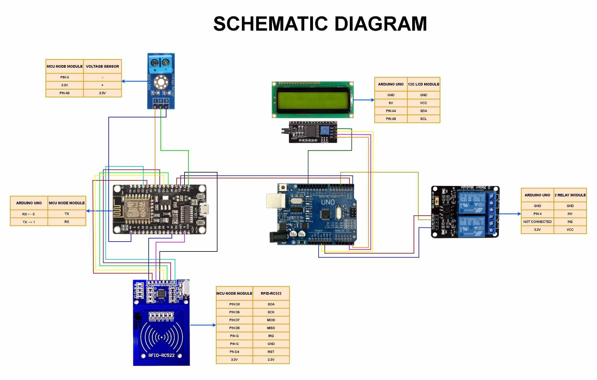

# POWER-WALK-DOCUMENTATION
- **Power Walk**: Converting Foot Traffic into Sustainable Energy, Utilizing Piezoelectric Transducers with RFID and Data Visualization for Efficient Power Generation at Quezon City University.

# Hardware:
## RFIDREADER.ino File
- This Arduino code is for reading the UID (Unique Identifier) of an RFID card using an RFID-RC522 module and an Arduino Uno (or similar board). It utilizes the MFRC522 and SPI libraries to communicate with the RFID module. This is what we use to store your RFID's UID to our system.

## ARDUINO.ino File
- This Arduino code is designed for an RFID-based "Free Charging Station", where students can scan their RFID cards to activate a charging session. If their RFID card is verified, the system allows them to charge their devices for 15 minutes before automatically turning off.

## NODEMCU.ino File
- [NODEMCU.ino File](https://github.com/JCJ02/power-walk-nodemcu-esp8266)

## HTTP Server of the Hardware
- [Server](https://github.com/JCJ02/power-walk-system-php)

# Software
## Frontend of Power Walk Software
- [Power Walk FE](https://github.com/JCJ02/power-walk-fe)

## Backend of Power Walk Software
- [Power Walk API](https://github.com/JCJ02/power-walk-api)

## Technologies:
- [Arduino IDE](https://www.arduino.cc/en/software)
- [Visual Studio Code](https://code.visualstudio.com/)
- [XAMPP](https://www.apachefriends.org/download.html)

## Programming Languages:
- [C++](https://www.w3schools.com/cpp/cpp_intro.asp)
- [TypeScript](https://www.typescriptlang.org/)
- [PHP](https://www.php.net/)

## Frameworks:
- [Node.js](https://nodejs.org/en)
- [Express.js](https://expressjs.com/)
- [React Vite](https://v3.vitejs.dev/guide/)
- [Tailwind CSS](https://tailwindcss.com/docs/installation/using-vite)

## Object-Relational Mapper (ORM)
- [Prisma](https://www.prisma.io/)
